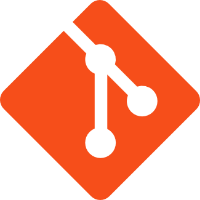
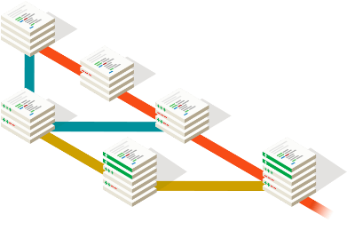
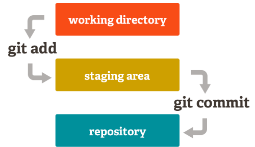
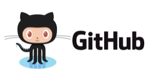
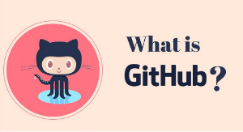
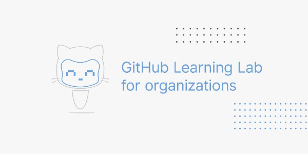
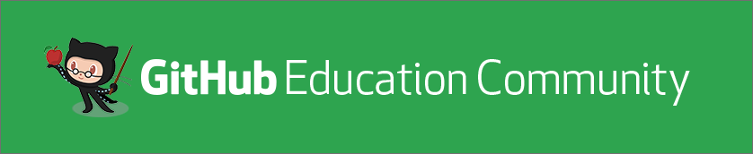

# GitHub - Classroom

# Agenda del curso

## Miércoles 2 de Junio de 2pm a 5pm
- Introducción GitHub Classroom
- Ambientes de Trabajo – Herramientas (IDE)
- Git
- GitHub
- Markdown
- GitHub – Tec de Monterrey
- GitHub Classroom
 
## Jueves 3 de Junio de 2pm a 5pm
- GitHub Classroom – continuación
- Classroom
- Roster
- Actividades
- Pruebas
- Templates
 
## Viernes 4 de Junio de 2pm a 4pm
- Creación de templates de actividades en GitHub Classroom

---

# Control de Versiones - git

## ¿Qué es Control de versiones?

Un control de versiones es un sistema que registra los cambios realizados en un archivo o conjunto de archivos a lo largo del tiempo, de modo que puedas recuperar versiones específicas más adelante.

## ¿Qué es git?

Es una herrramienta que se encarga de almacenar una foto (snapshot) de cada archivo cuando este es modificado y guarda una referencia a esta copia instantanea. En caso de que el archivo no haya sido modificado, git lo que hace es que almacena una referencia al archivo anterior idéntico.

## Tres estados de git

- confirmado (commited)
- modificado (modified)
- preparado (staged)

## Comandos git

### [Git Cheat Sheet](https://education.github.com/git-cheat-sheet-education.pdf)

---

# GitHub

## ¿Que es GitHub?

- Es una plataforma de colaboración
- Es una herramiento de control de versiones
- Es una plataforma de apoyo al desarrollo de aplicaciones muy tulizada en el mundo.
- Herramienta para el apoyo en la administración de proyectos de desarrollo de aplicaciones

## Componentes/Herramientas de GitHub

- Repositorios
- Projectos
- Sitios Web (Pages)
- Foros de discusión
- IDE en web (GitHub Codespaces)
- GitHub Desktop

### [Documentación GitHub](https://docs.github.com/en)

### [Curso de introducción a GitHub](https://lab.github.com/githubtraining/introduction-to-github)

---

# GitHub Markdown

GitHub Markdown es un lenguaje ligero y fácil de usar para dar estilo a todos los escritos dentro de la plataforma de GitHub.

## ¿Qué es GitHub Markdown?

Es una forma de darle stilo al texto en la web.

### [Guí de uso de GitHub Markdown](https://guides.github.com/features/mastering-markdown/)
---

# Comunidad GitHub Tec de Monterrey

Espacio de colaboración entre alumnos y profesores para compartir mejores prácticas, cursos, noticias, eventos y avisos sobre el uso de GitHub Empresarial en el Tec de Monterrey.

### [Comunidad GitHub Classroom en Microsoft Teams](http://bit.ly/GitHub-Classroom)

---
# GitHub - Classroom

## Apoyos

- ### [Documentación GitHub Classroom ](https://docs.github.com/en/education/manage-coursework-with-github-classroom/get-started-with-github-classroom)

- ### [Autograding en GitHub Classroom](https://docs.github.com/en/education/manage-coursework-with-github-classroom/teach-with-github-classroom/use-autograding)

- ### [Publicación en GitHub Education Comunity para compartir templates de actividades](https://education.github.community/t/share-your-autograding-templates-here/54684)

---
# Autograding

## Herramientas de Testing

## Python

### [Documentación Pytest](https://docs.pytest.org/en/6.2.x/)

## c++

### [Documentación Catch2](https://github.com/catchorg/Catch2)

---
# Herramientas de apoyo 

 

 

## Referencias
https://git-scm.com/

https://guides.github.com/

